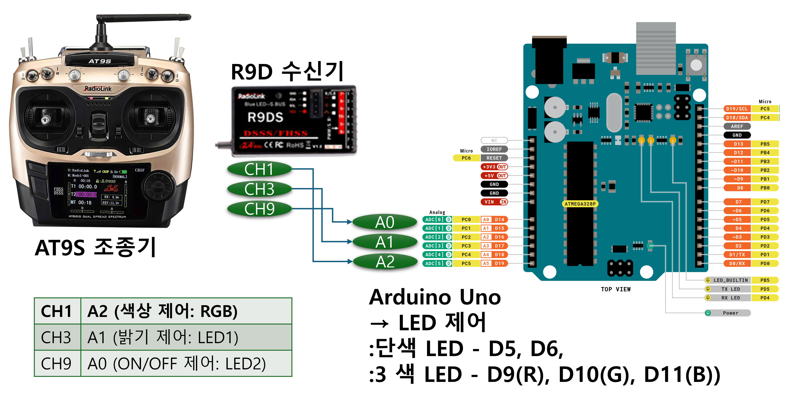
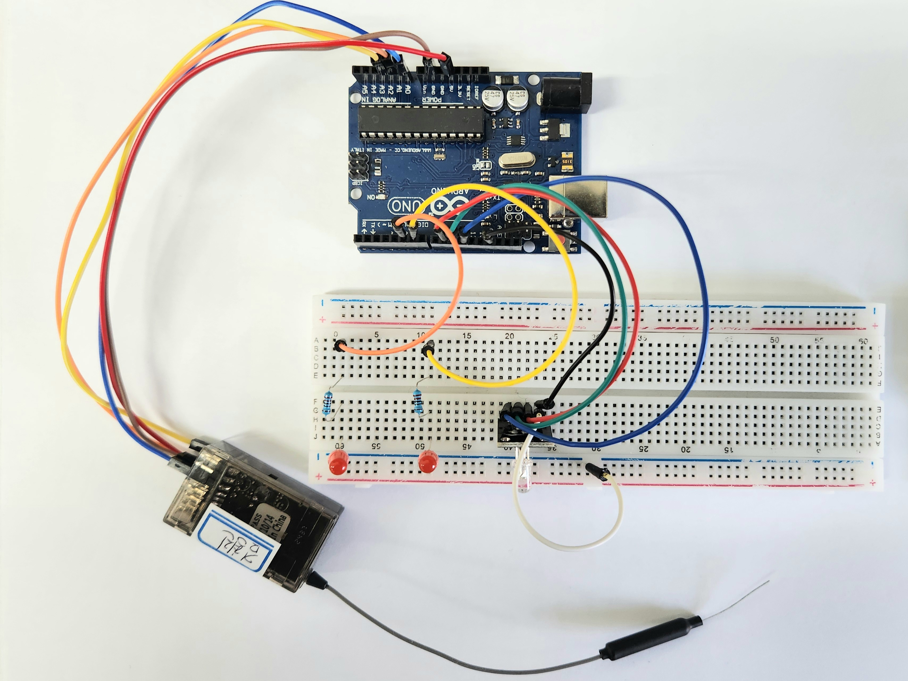

# 임베디드 통신시스템 프로젝트 - RC 조종기로 아두이노 LED 제어

## 시연 영상
아래 링크를 통해 R9D 수신기와 AT9S 조종기를 사용한 LED 제어 프로젝트의 실제 동작 영상을 확인할 수 있습니다.  
[](https://youtu.be/wgoNXr9NGfQ)

[3색 LED의 연속적 변화 기능을 추가한 새로운 시연영상](https://youtube.com/shorts/pGXUohaWYyQ)입니다. 시연에 해당하는 부분은 이 부분을 참고해주시면 감사하겠습니다.

---

## 개요
본 프로젝트는 RC 조종기 **AT9S**와 수신기 **R9D**, 그리고 **Arduino Uno**를 이용해  
3채널의 PWM 신호로 **LED ON/OFF 제어**, **밝기 조절**, **RGB 색상 연속 변경**을 구현한 임베디드 제어 시스템입니다.

PWM 신호는 아두이노에서 `PinChangeInterrupt` 라이브러리를 이용해 측정되며,  
아날로그 출력(PWM)을 통해 LED를 직관적으로 제어합니다.

---

## 시스템 다이어그램
아래 다이어그램은 R9D 수신기, 아두이노, 그리고 LED 간의 신호 흐름을 나타냅니다.



---

## 하드웨어 구성

### 1. 아두이노 회로도
아래 이미지는 Arduino 보드와 LED, R9D 수신기가 어떻게 연결되는지를 개략적으로 보여줍니다. 실제 배선 예시는 다음과 같습니다:



### 2. 핀 연결 상세

| Arduino 핀 | 연결 대상     | 설명                                 |
|------------|----------------|--------------------------------------|
| **A0**     | R9D CH9        | ON/OFF 제어용 PWM 입력               |
| **A1**     | R9D CH3        | 밝기 조절용 PWM 입력                |
| **A2**     | R9D CH1        | RGB 색상 조절용 PWM 입력            |
| **D5**     | LED2 (+저항)   | ON/OFF 제어용 단색 LED 출력         |
| **D6**     | LED1 (+저항)   | 밝기 조절용 단색 LED (PWM 출력)     |
| **D9**     | RGB LED R 핀   | PWM 출력                            |
| **D10**    | RGB LED G 핀   | PWM 출력                            |
| **D11**    | RGB LED B 핀   | PWM 출력                            |
| **GND**    | 모든 LED 음극 | 공통 접지                            |
| **5V**     | R9D 수신기     | 전원 공급 (또는 외부 배터리 사용)    |

> LED에는 **220Ω 저항**을 직렬 연결해 전류 제한을 해주었습니다.

---

## 소프트웨어 개요

### Arduino 기능 요약

- **PinChangeInterrupt** 라이브러리를 이용한 **PWM 신호 수신**
- **채널 9**: PWM 값 > 1800일 때 LED2 ON / 이하일 때 OFF
- **채널 3**: PWM 값 1068-1932μs 범위 → LED1 밝기 0-255로 선형 매핑
- **채널 1**: PWM 값을 Hue(색상 각도) 0-300도로 변환하여,  
  RGB LED가 **빨강 → 초록 → 파랑**으로 부드럽고 연속적으로 색상이 전환되도록 구현됨

### 주요 파일 및 함수

- **main.cpp**:  
  - `setup()`: 핀 모드 설정, 인터럽트 등록, 시리얼 시작  
  - `loop()`: 각 채널 상태 업데이트 및 PWM 신호 처리  
  - `update_led2_onoff()`: CH9 스위치에 따른 LED ON/OFF  
  - `update_led1_brightness()`: CH3 조이스틱 위치 → 밝기 제어  
  - `update_rgb_color()`: CH1 조이스틱 위치 → **HSV 기반 RGB 색상 연속 변화**

---

## 사용 방법

1. **회로 연결**
   - 위의 핀맵에 따라 R9D 수신기와 아두이노, LED를 정확히 연결합니다.

2. **조종기 설정**
   - AT9S 조종기에서 CH1, CH3, CH9을 PWM 출력 모드로 설정합니다.
   - 트림 값에 불필요한 조작을 가하지 않습니다.

3. **코드 업로드**
   - Arduino IDE 또는 PlatformIO를 사용해 제공된 `main.cpp`를 업로드합니다.
   - `PinChangeInterrupt` 라이브러리를 설치해야 합니다.

4. **시연**
   - 조이스틱 및 스위치를 조작하여 각 LED의 상태가 실시간으로 변하는 것을 확인합니다.

---

## 참고 정보

- **PWM 측정 단위**: 마이크로초(`micros()`), 일반적으로 1000~2000μs 범위
- **정확한 PWM 수신값**은 `Serial Monitor`를 통해 1초 간격으로 확인 가능
- **조이스틱 데드존**은 자동으로 무시되며, 최솟값일 때 LED가 꺼집니다.

---

## 기타 사항

- PWM 입력값이 수신기나 조종기 설정에 따라 약간 다를 수 있으므로,  
  코드 상단에 정의된 `CH3_PWM_INPUT_MIN`, `CH3_PWM_INPUT_MAX`는 실제 측정값 기준으로 조정해야 합니다.
- RGB 색상은 **PWM 입력값을 기반으로 HSV 색상 모델의 Hue(색상 각도)**로 변환되며,  
  **Hue 0°~300° 범위**를 따라 **빨강 → 초록 → 파랑**의 연속적인 색상이 자연스럽게 변화합니다.


---

## 디렉터리 구조
 
```plaintext
ESC_TRANSCEIVER_LED_TEST/
├── .vscode/                  # VSCode 설정 (tasks, launch 등)
│
├── image/                    # 프로젝트 회로도 및 시스템 구조 이미지
│   ├── Arduino_r9ds_circuit.jpg     # R9D 수신기 기반 아두이노 회로 구성도
│   └── S1_System_Diagram.png        # 전체 시스템 흐름 다이어그램
│
├── include/                  # 헤더 파일 디렉토리 (현재 비어 있음)
│
├── lib/                      # 외부 라이브러리 디렉토리 (사용 시 여기에 추가)
│
├── src/                      # 메인 소스 코드 디렉토리
│   └── main.cpp              # 아두이노 메인 구현 파일
│
├── test/                     # 테스트 코드 디렉토리 (현재 비어 있음)
│
├── .gitignore                # Git 추적 제외 항목 정의 파일
├── LICENSE                   # 라이센스 정보 파일
├── platformio.ini            # PlatformIO 환경 설정 파일
└── README.md                 # 프로젝트 설명 문서 (최상위)

```
---

## 라이선스

이 프로젝트는 [MIT License](./LICENSE) 하에 오픈소스로 공개됩니다.

## 추가 참고
더 자세한 설명은 src폴더의 main.cpp의 코드 주석을 참고해주세요.  
필요한 설정, 함수별 동작 원리, 그리고 확장 아이디어가 상세히 기재되어 있습니다.